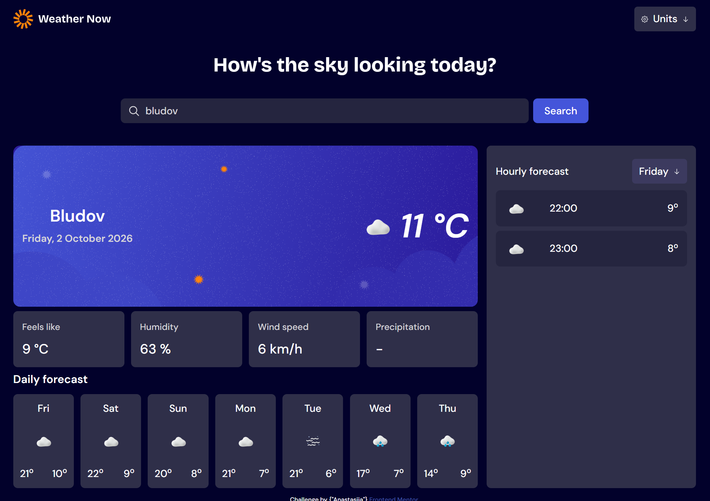

# Frontend Mentor - Weather app

This is a solution to the [Typing Speed Test challenge on Frontend Mentor](https://www.frontendmentor.io/challenges/typing-speed-test). Frontend Mentor challenges help you improve your coding skills by building realistic projects. 

## Table of contents

- [Overview](#overview)
  - [The challenge](#the-challenge)
  - [Screenshot](#screenshot)
  - [Links](#links)
- [My process](#my-process)
  - [Built with](#built-with)
  - [What I learned](#what-i-learned)
  - [Continued development](#continued-development)
  - [Useful resources](#useful-resources)
  - [AI Collaboration](#ai-collaboration)

## Overview
### The challenge
The challenge name is Weather app. Requirements are under this link https://www.frontendmentor.io/challenges/typing-speed-test

### The challenge description
- The application is fully responsive, with the layout adjusting automatically to provide a suitable experience across different screen sizes.
- Users can look up a location by typing into the search field or, where supported, by using voice input.
- Once a location is selected, the app presents the current conditions along with the relevant temperature, weather status, icon, and location information.
- More detailed information is available for the current conditions, including humidity, wind speed, precipitation, and the temperature as it actually feels outside.
- A weekly overview gives users a quick way to check the forecast for the next seven days, including expected minimum and maximum temperatures and corresponding weather indicators.
- The forecast can also be explored on an hourly basis, making it possible to see how temperatures are expected to change during a particular day. Users can move between days to update the hourly forecast and explore different parts of the week.
- Measurement preferences can be customized from the units menu: netric or imperial.
- Interactive controls throughout the interface include visible hover and focus feedback to make their current state clear.

### Screenshot

### Links
- Live Site URL: [GitHub Pages](https://asja56.github.io/weather-app/)

## My process

### Built with

- Semantic HTML5 markup
- CSS custom properties
- [React] as a library from TypeScript
- [Tailwind] for styling

### What I learned
This is the test, where I want to try to learn about the usage of React and how it works. I need to do more fundamental preparation before I work on another challenge with React, this one showed me that I'm not prepared to work with React and communication betwenn components was a real headache for me. 

### AI Collaboration
One of the reasons I do these challenges is to avoid brainrot from relying on AI to do everything for me. So no, AI didn’t code this project for me. I did use ChatGPT and Copilot to break the challenge into smaller tasks because, honestly, I had no idea where to start.

While working on it, I realized how unprepared I actually was with React. Styling and HTMl was not a question, because it's similar between a lot of frameworks, but communication between components? make it all work? Those nasty comment from Eslint?. I used ChatGPT and Copilot when I got stuck with bugs or didn’t understand something, but I noticed that AI was much better at finding an answer than actually explaining why the answer worked. That made me realize how important it is to understand the technology first instead of trying to learn everything only when you need it.

That said, using ChatGPT and Copilot for help isn’t that different from searching Google or Stack Overflow, which I used as well. I tried to use AI as little as possible and still do the actual thinking and coding myself.

At the end of the day, AI helped me get unstuck, but it didn’t do the work for me. Although, looking at the quality of the code, I’m still not entirely sure whether I’m getting smarter or ChatGPT and Copilot is. 😅